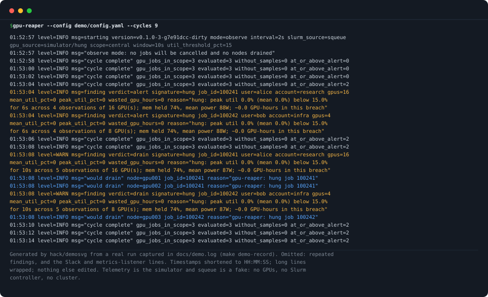

# gpu-reaper

**Finds wasted GPU allocations on Slurm clusters and, only if you enable it,
drains and cancels them. Its guardrails refuse to act on missing, stale or
unreadable telemetry.**

> **Status: v0.x, not yet run on a real cluster.** Everything below has been
> exercised against a GPU simulator, a fake `squeue`, fake `nvidia-smi`, fake
> `scancel`/`scontrol` and synthetic dcgm-exporter pages. Nothing has been run
> against a real Slurm controller or a real GPU. Treat the behaviour described
> here as designed and tested, not as observed in production.

<p align="center">
  
</p>

Find wasted GPU allocations on a Slurm cluster. Alert on them, drain the nodes,
or cancel the job, in that order, and only as far as you tell it to go.

```
make demo
```

No cluster, no GPUs, no risk: a fake `squeue` on `PATH`, simulated telemetry,
observe mode. Two jobs are classified `hung`. The first alert comes once the
(compressed, 10-second) window is covered, and the dry-run drain a few cycles
later. In the committed capture (`docs/demo.log`, made with
`make demo-record`), the first alert came 6 s after the first cycle and the
dry-run drain 10 s after it. `make demo-once` runs a single cycle and reports
nothing, because one snapshot is never evidence of a sustained breach.

---

## The problem

A researcher requests 16 H100s for a 48-hour run. Four hours in, the training
script deadlocks on a NCCL all-reduce because one rank died. The allocation is
still held. Slurm is content: the job is `RUNNING`, the nodes are busy, the
queue is moving.

Slurm can record per-job GPU utilization (`gres/gpuutil`, gathered when
`AccountingStorageTRES=gres/gpu` is set with `AutoDetect=nvml`, and not for MIG
devices, per [gres.html](https://slurm.schedmd.com/gres.html)), but it does
not act on it.

That is 16 GPUs × 44 hours = **704 GPU-hours** of a resource with a waiting
queue, consumed by a process doing nothing. (An illustrative example, not a
measurement.)

## What it does



<sub>Everything left of the gate is on by default and changes nothing in the
cluster. Everything right of it requires `mode: enforce`. A drained node stays
drained until an administrator resumes it.</sub>

```
┌──────────────┐        ┌──────────────────────────┐
│   squeue     │        │ nvidia-smi (per node)    │
│  slurmrestd  │        │ dcgm-exporter (central   │
└──────┬───────┘        │   or per node)           │
       │ running jobs   └──────┬───────────────────┘
       │ nodes, TRES           │ util, mem, power, PIDs (nvidia-smi only)
       └───────────┬───────────┘
                   ▼
         ┌───────────────────┐
         │   policy engine   │  warmup · window coverage · gaps · staleness
         │                   │  signature classification · the ladder
         └─────────┬─────────┘
                   │ Finding{verdict, signature, gpu-hours}
       ┌───────────┼───────────┬──────────────┐
       ▼           ▼           ▼              ▼
    ┌──────┐  ┌────────┐  ┌────────┐   ┌────────────┐
    │ log  │  │ slack  │  │ drain  │   │  scancel   │
    └──────┘  └────────┘  └────────┘   └────────────┘
                            └── only in mode: enforce ──┘
```

## Why it will not kill your job

Killing a healthy job is much worse than letting a wasted one run another hour.
A researcher whose 40-hour run dies at hour 39 loses the run *and* their trust in
the tool. A wasted allocation surviving one more cycle costs one more cycle.

Every default follows from that asymmetry. Each row names the tests that pin
it down. They run against fakes, fixtures and a simulator, not a cluster.

| Guard | Behaviour | Tests |
| --- | --- | --- |
| **Observe by default** | `mode: observe` wires a controller that cannot touch the cluster, *and* the cluster actor refuses to call any controller unless enforcing. A mistake in either alone cancels nothing. | `TestObserveModeWiresNoopController`, `TestClusterActorNeverCallsControllerWhenNotEnforcing`, `TestObserveModeNeverCallsController` |
| **Warmup** | Jobs younger than `warmup` (15m) are not judged, and samples taken during warmup are discarded, so the earliest verdict is `warmup + window − max_sample_gap` after start (32m by default). | `TestWarmupIsNeverJudged`, `TestClaim_WarmupSamplesAreNotEvidence` |
| **Covered window** | A breach is confirmed only when, on every node, the evidence spans at least `window − max_sample_gap`, holds at least `min_samples` distinct observations (cycles, not per-GPU samples), and every sample breaches. One snapshot is never enough. | `TestClaim_OneSnapshotIsNotASustainedBreach`, `TestInvariant_NoEscalationWithoutContiguousEvidence` |
| **Peak, not mean** | One sample at or above the threshold on any GPU anywhere in the window means alive. | `TestOneBusySampleClearsTheFinding` |
| **Gaps, staleness, outages** | A hole between observations larger than `max_sample_gap`, or a newest sample older than that, resets the breach clock *and* the escalation history. With the defaults (interval 2m, gap 3m) any failed cycle leaves such a hole. A shorter hole is tolerated by design: where `max_sample_gap` is at least twice `interval` (the demo's 2s and 5s, for example), one failed cycle stays inside it and the observations either side still count as contiguous evidence. After a reset the window must be covered again and the ladder climbed again from Alert. | `TestClaim_OutageLongerThanWindowNeverEscalates`, `TestCollectorOutageInsideTheWindowIsNotIdleness`, `TestStaleNewestSampleIsNotJudged`, `TestCollectorFailureNeverEscalates`, `TestOneFailedCycleResetsWithDefaultTiming`, `TestHoleWithinMaxSampleGapIsToleratedByDesign` |
| **Unreadable is unknown, never idle** | `[N/A]`, `[Not Supported]` and error values are unknown, not 0. A GPU with unreadable utilization or memory, or in MIG mode, stops its job being judged. Unknown process or power data can never satisfy `idle` or `hung`. | `TestSMIUnreadableFieldsAreUnknownNotZero`, `TestSMIRefusesMIGEnabledGPUs`, `TestMIGGPUsAreNotJudged`, `TestClaim_UnreadableTelemetryIsNeverIdle`, `TestIdleAndHungNeedPositiveEvidence`, `TestDCGMMissingUtilizationIsUnknownNotIdle` |
| **Every node, every GPU** | A job is judged only with telemetry for every one of its nodes, covering at least as many GPUs as it holds. A per-node daemon therefore judges only single-node jobs on its own node. | `TestClaim_PerNodeDaemonNeverActsOnAMultiNodeJob`, `TestPartialNodeEvidenceIsNotJudged`, `TestFewerGPUsThanAllocatedIsNotJudged` |
| **Signature gating** | `starved` and `unknown` never pass Alert. `hung` stops at Drain unless `allow_cancel_signatures` includes it, because a long checkpoint write looks the same. | `TestStarvedJobsAreNeverEscalatedPastAlert`, `TestUnknownSignatureCapsAtAlert`, `TestHungIsNotCancelledByDefault` |
| **The ladder** | Drain needs an Alert on a previous cycle. Cancel needs a drain that was *executed and confirmed* at least one `window` earlier. A failed drain is retried and blocks Cancel. | `TestClaim_CancelNeedsCoverageAlertDrainAndAWindow`, `TestFailedDrainBlocksCancel`, `TestFailedDrainIsRetriedAndBlocksCancel` |
| **Requeue** | A job that keeps its JobID but has a new StartTime is a new job with no history. | `TestClaim_RequeuedJobStartsOver` |
| **Shared nodes skipped** | Where a node hosts several GPU jobs, per-GPU attribution is ambiguous, so its jobs are skipped and counted. | `TestSharedNodeJobsAreSkipped` |
| **Reason before cancel** | The cancel reason is written to the job's AdminComment first; if that fails, the job is not cancelled. | `TestCancelIsNotAttemptedWhenReasonCannotBeRecorded` |
| **Exemptions** | By user, account, partition, QOS, or job-name regex (case-insensitive lists). | `TestExemptions`, `TestExemptionMatchIsCaseInsensitive`, `TestNamePatternIsDecoded` |

`TestInvariant_NoEscalationWithoutContiguousEvidence` drives 300 seeded random
streams (outages, unreadable GPUs, bursts of work, jittered cycles, failing
drains, random stage settings) and checks each verdict against an independent
record of what was delivered. For every row above, the guard's code was
disabled in turn in a scratch copy and at least one listed test failed. That
check was run by hand, not in CI (see CHANGELOG).

## Signatures

Low utilization has several causes and they deserve different responses.

| Signature | Evidence | Meaning | Max escalation |
| --- | --- | --- | --- |
| `idle` | No memory held; process list read and empty; power read and below `idle_power_watts` | Allocation is empty | `cancel`, if a cancel stage is configured |
| `hung` | Memory held; processes seen; **zero** compute | Deadlocked collective, stuck ring, *or a long checkpoint write* | `drain` (`cancel` only if listed in `allow_cancel_signatures`) |
| `starved` | Memory held, low but nonzero compute | Dataloader bottleneck: real waste, but a tuning problem | `alert` |
| `unknown` | Breaching, but no signature matches, including when process or power data is missing | Not modelled; never acted on | `alert` |

## Configuration

`config.example.yaml` is a production starting point (observe mode, default
stages, cancel off) and is loaded by a test, so it cannot drift into an invalid
or aggressive state. Every key is checked: an unknown or misspelled key is an
error, not a silent no-op.

```yaml
mode: observe            # observe | enforce
interval: 2m
metrics_addr: ":9835"
log_format: json         # text | json

slurm:
  source: squeue         # squeue | rest
  squeue_path: /usr/bin/squeue       # absolute paths required in enforce mode
  scancel_path: /usr/bin/scancel
  scontrol_path: /usr/bin/scontrol
  # rest_url: http://slurmrestd:6820
  # rest_version: v0.0.42
  # username: slurm
  # token_file: /run/secrets/slurm-jwt   # re-read on every request
  # token_env: SLURM_JWT                 # read once; `scontrol token` JWTs default to 1800 s

gpu:
  source: nvidia-smi     # nvidia-smi | dcgm | simulator
  # nvidia_smi_path: /usr/bin/nvidia-smi   # default: looked up on PATH; must be absolute in enforce mode
  # node_name: gpu001    # this host's Slurm NodeName (--node-name overrides)
  # dcgm:
  #   url: "http://{node}:9400/metrics"   # {node} = central mode
  #   timeout: 5s
  #   max_age: 2m        # only applies if the exposition carries timestamps

thresholds:
  util_pct: 15           # utilization below this counts as a breach
  mem_held_fraction: 0.05
  idle_power_watts: 60
  window: 20m            # breach must be covered and sustained this long
  warmup: 15m            # grace period after job start; its samples are discarded
  min_samples: 8         # observations (cycles) per node
  max_sample_gap: 3m     # bigger hole ⇒ collector fault; resets history

stages:
  - { after: 0m,  verdict: alert }
  - { after: 60m, verdict: drain }
  # - { after: 4h, verdict: cancel }   # requires mode: enforce

allow_cancel_signatures: [idle]        # add hung deliberately, or not at all

exemptions:
  users: [ci-bot]
  partitions: [interactive]
  name_pattern: "^(debug|jupyter)-"

slack:
  webhook_env: SLACK_WEBHOOK_URL
  min_verdict: alert
  remind_every: 4h       # post on verdict change, and repeat this often; 0 = never
```

The validator rejects, at startup, configurations that would run but not do
what they appear to:

- `interval < max_sample_gap < window`. Otherwise every ordinary cycle gap
  looks like a collector fault (nothing is ever judged), or one snapshot
  "covers" the window.
- `min_samples × interval ≤ window`. Otherwise no breach can ever be confirmed.
- `0 < util_pct ≤ 100`, `0 ≤ mem_held_fraction ≤ 1`, non-negative warmup and
  power.
- Drain and cancel stages must be at least `window` long. Dwell is measured
  from the first breaching observation, so it is already about one window at
  the first confirmation. This applies to the default stages too when
  `stages:` is omitted (drain after 60m), so a `window` above 60m needs
  explicit stages.
- `allow_cancel_signatures` may contain only `idle` and `hung`.
- In `enforce` mode, `slurm.scancel_path` and `slurm.scontrol_path` must be
  absolute, and so must `slurm.squeue_path` when `slurm.source: squeue` and
  `gpu.nvidia_smi_path` when `gpu.source: nvidia-smi`. A writable directory
  earlier in `PATH` then cannot substitute its own. squeue decides which jobs
  are on which node and nvidia-smi decides what is idle, so a substitute for
  either could steer a drain or cancel as surely as one for scancel.

`name_pattern` was silently ignored before this validation existed: the field
had no YAML tag, so the documented key never matched. It now works, and is
tested.

## Metrics

Exposed at `/metrics`. **No `job_id` label anywhere.** A busy cluster cycles
through millions of job IDs, and a per-job label set would take Prometheus down
before it told anyone anything. Per-job detail is in the structured log.

| Metric | Type | Labels |
| --- | --- | --- |
| `gpu_reaper_findings` | gauge | `verdict`, `signature`, `partition` |
| `gpu_reaper_wasted_gpu_seconds_total` | counter | `partition`, `signature` |
| `gpu_reaper_wasted_gpu_hours` | gauge (currently accruing) | `partition`, `signature` |
| `gpu_reaper_gpus_held_breaching` | gauge | `partition`, `signature` |
| `gpu_reaper_jobs_evaluated` | gauge | — |
| `gpu_reaper_gpu_jobs_without_samples` | gauge | — |
| `gpu_reaper_actions_total` | counter | `actor`, `verdict`, `outcome` (`acted` \| `dry_run`) |
| `gpu_reaper_action_errors_total` | counter | `actor` |
| `gpu_reaper_scrape_duration_seconds` | histogram | — |
| `gpu_reaper_scrape_errors_total` | counter | `source` |
| `gpu_reaper_source_rejected_records_total` | counter | `source` |
| `gpu_reaper_skipped_shared_node_total` | counter | — |
| `gpu_reaper_skipped_partial_evidence_total` | counter | — |
| `gpu_reaper_skipped_attribution_conflict_total` | counter | — |
| `gpu_reaper_last_successful_cycle_timestamp_seconds` | gauge | — |

Observed waste over a week, in GPU-hours:

```promql
sum by (partition, signature) (increase(gpu_reaper_wasted_gpu_seconds_total[7d])) / 3600
```

The counter adds, each cycle, the breach time observed since the last cycle ×
the GPUs attributable to the job (at most the number it holds). Warmup is
excluded. It measures waste the tool *saw*; it does not measure GPU-hours
reclaimed, which would need to know what the job would have done next. The
`gpu_reaper_wasted_gpu_hours` gauge is the size of breaches in progress and
drops to zero when a job ends or recovers, so do not sum it over time.

Alert on the daemon itself, too: a reaper whose every cycle fails reports no
findings and looks exactly like a healthy cluster.

```promql
time() - gpu_reaper_last_successful_cycle_timestamp_seconds > 3 * 120
```

A rising `gpu_reaper_skipped_shared_node_total` means your cluster packs
multiple GPU jobs per node and this tool is not covering them. A persistently
non-zero `gpu_reaper_gpu_jobs_without_samples` means GPU jobs whose nodes
returned no telemetry; in central mode that is usually a node-name mismatch or
an exporter that is down. In per-node mode it cannot show a node-name
mismatch, because jobs that do not list this daemon's node name are dropped
before it is counted. See Node names under Limitations for what to watch
instead.

## Deployment

There are two scopes. Choose one explicitly.

**Per node.** One daemon per GPU node, with `gpu.source: nvidia-smi` (or
`dcgm` with a fixed localhost URL). It reads only local GPUs and asks `squeue`
only for jobs on its node (`--nodelist`). Because a job is judged only on
evidence from every one of its nodes, a per-node daemon judges **only
single-node jobs on its own node**; multi-node jobs are skipped and counted in
`gpu_reaper_skipped_partial_evidence_total`. `gpu.node_name` (or
`--node-name`) must be the Slurm NodeName; it defaults to the OS hostname.

**Central.** One daemon with `gpu.source: dcgm` and a URL containing `{node}`
(for example `http://{node}:9400/metrics`, dcgm-exporter's documented default
port and path). It scrapes every node that has a GPU job, judges multi-node
jobs when every node answers, and is the only host that needs Slurm
credentials. **The DCGM source has not been run against a real dcgm-exporter;**
see Limitations.

```bash
gpu-reaper --config /etc/gpu-reaper/config.yaml
gpu-reaper --config ... --once            # single cycle, for cron or testing
gpu-reaper --config ... --cycles 10       # bounded run
gpu-reaper --config ... --node-name gpu001
```

`/healthz` is liveness (always 200 while the process runs). `/readyz` returns
503 until a cycle has listed jobs and collected telemetry, and again if none has
for three intervals. Point readiness probes and paging at `/readyz`.

**Enforcement privileges.** Start in `observe`, watch `gpu_reaper_findings` for
a week, and only then decide whether the findings are trustworthy enough to act
on. What enforce mode needs, as far as the Slurm documentation states it:

- Cancelling other users' jobs: "users who have an AdminLevel defined
  (Operator or Admin) and users who are account coordinators"
  ([scancel](https://slurm.schedmd.com/scancel.html)).
- Recording the cancel reason: AdminComment "Can only be set by a Slurm
  administrator" ([scontrol](https://slurm.schedmd.com/scontrol.html)). Since
  gpu-reaper refuses to cancel without recording the reason, cancelling needs
  Admin.
- Draining nodes: we did not find a page stating which AdminLevel suffices.
  Admin users can "alter anything on a served slurmctld as if they were the
  slurm user or root" ([accounting](https://slurm.schedmd.com/accounting.html)).

That is cluster-wide destructive capability. Run enforce mode on one central
host, not on every compute node. Per-node daemons are best left in observe mode.

**Kubernetes and Slinky.** No manifests or Helm chart ship yet. The image
(below) supports `slurm.source: rest` and `gpu.source: dcgm` (both HTTP only),
which suits a single central Deployment. For a per-node agent: Slinky's
slurm-operator README describes NodeSet pods with predictable hostnames such
as `gpu-2-1`. Whether a given deployment's Slurm NodeName equals that pod
hostname is not verified here. Check `scontrol show node`, and pass
`--node-name` (for example from the downward API via an environment variable
in the container args) if not. The same README says the operator marks Slurm
nodes drain "before their eventual termination pending scale-in or upgrade".
How gpu-reaper's drains should coexist with that lifecycle has not been
designed or tested.

**Container image.** Distroless (glibc) base. It contains only the
`gpu-reaper` binary: no `squeue`, `scancel`, `scontrol` or munge. So inside
the image, `slurm.source: squeue` and enforce mode do not work as shipped, and
`gpu.source: nvidia-smi` works only if the NVIDIA runtime mounts
`nvidia-smi` in.

## Limitations

Stated plainly, because they bound what the tool can claim:

- **Not run on real hardware or a real cluster.** See the status note at the
  top.
- **Drain is never undone.** gpu-reaper drains to quarantine; it never resumes
  a node. After a drain, and after a cancel, the node stays DRAINED until an
  admin runs `scontrol update NodeName=<node> State=RESUME`. No tool in this
  set resumes nodes; epilog-gpu-validator also only drains. If a drained job
  recovers, the daemon logs a warning naming the nodes; it does not resume
  them. In enforce mode this removes capacity until someone acts.
- **Multi-node jobs need a central source.** A per-node daemon skips them by
  design (see Deployment).
- **The DCGM source is unverified.** It is written against dcgm-exporter's
  source (metric names from `etc/default-counters.csv`, labels from
  `internal/pkg/rendermetrics/render_metrics.go`, `hpc_job` from
  `internal/pkg/transformation`, main at commit fafd151) and tested only on
  synthetic pages. dcgm-exporter exposes no per-process data, so DCGM-backed
  findings can never be `idle` or `hung` and never pass Alert. A GPU whose
  series carry `hpc_job` labels naming other jobs stops the job being judged.
  The labels are a cross-check, not an attribution source. dcgm-exporter sets
  no sample timestamps, so `max_age` only applies if something in between adds
  them; a stalled exporter that still answers is not detected.
- **MIG is not judged.** NVIDIA's nvidia-smi manual says utilization "is not
  currently supported" on MIG-enabled GPUs. gpu-reaper queries
  `mig.mode.current` and refuses to judge a job with any MIG-enabled GPU
  (likewise for DCGM series with MIG instance labels), rather than reading the
  missing value as 0%.
- **Shared-node attribution.** GPU samples identify a node, not a job. Where
  one node hosts several GPU jobs, the reaper skips them rather than guess, and
  counts them in `gpu_reaper_skipped_shared_node_total`.

  Correct attribution means walking the Slurm cgroup hierarchy to map GPU PIDs
  back to jobs. **Note for Slurm 26.05 and later:** that hierarchy changed. With
  cgroup/v2, job directories are now named by SLUID, e.g.
  `/sys/fs/cgroup/system.slice/slurmstepd.scope/sEKNKTV3WPV500/` instead of
  `.../job_123/`, unless `CgroupJobIdPaths=yes` restores the numeric layout
  ([cgroup.conf](https://slurm.schedmd.com/cgroup.conf.html)). Any
  implementation has to handle both. This is deliberately out of scope here,
  and no tool in this set maps GPU processes to jobs today. ib-slurm-exporter
  walks the same cgroup tree, but to attribute InfiniBand counters, not GPUs.
- **nvidia-smi utilization is coarse.** A kernel occupying one SM reports the
  same 100% as a saturated device. That is why *high* utilization is never
  treated as proof of health, only *low* utilization as evidence of a problem.
  The DCGM source takes the maximum of `DCGM_FI_DEV_GPU_UTIL` and, when
  exported, the profiling activity ratios, which can only make a GPU look
  busier.
- **Process visibility.** An empty process list is trusted as "no processes".
  Inside a container without the host PID namespace, nvidia-smi may list no
  processes that do exist. That can only turn `hung` into `unknown` (alert
  only), or leave an allocation `idle` that holds less than
  `mem_held_fraction` of memory and draws idle power.
- **Node names.** The daemon matches telemetry to jobs by Slurm NodeName. A
  mismatch (FQDN vs short name, a pod name) means those jobs are never
  judged. How it shows depends on the scope. In central mode the affected
  jobs get no telemetry and are counted in
  `gpu_reaper_gpu_jobs_without_samples`. In per-node mode every job is
  dropped as "not on this node" before that gauge is counted, so it stays at
  0, and so do `gpu_reaper_jobs_evaluated` and the cycle log's
  `gpu_jobs_in_scope`. With `slurm.source: squeue` the daemon logs a warning
  when squeue returns GPU jobs none of which lists this node. squeue's
  `--nodelist` takes "the NodeName or NodeHostname"
  ([squeue](https://slurm.schedmd.com/squeue.html)); the page does not say
  what it returns for any other name, so whether the warning fires is
  unverified. With `slurm.source: rest` there is no warning. On a node known
  to host a single-node GPU job with no GPU co-tenant,
  `gpu_reaper_jobs_evaluated` stuck at 0 is the signal.
- **squeue parsing.** Times are forced to UTC and the standard format, and job
  names are the last field, so a `|` in a name cannot shift other fields.
  Whether Slurm accepts a newline in a job name is unverified; if it does, a
  crafted name could inject a line. Such a line must still pass strict
  validation, and duplicated job IDs are dropped. `slurm.source: rest` avoids
  text parsing entirely.
- **NVIDIA only.** No ROCm or Habana backend.
- **Single-cluster.** One controller per daemon.

## Related work

- **Jobstats and Job Defense Shield** (Princeton Research Computing). Job
  Defense Shield "can (1) send automated email alerts to users, (2) create
  reports for system administrators, and (3) automatically cancel GPU jobs at
  0% utilization" ([GitHub](https://github.com/PrincetonUniversity/job_defense_shield));
  it is a component of the Jobstats monitoring platform
  ([PEARC '23 paper](https://dl.acm.org/doi/10.1145/3569951.3604396)).
- **GPU-Watch: An Autonomous Node-Level GPU Utilization Enforcement Framework
  for Slurm Clusters**, PEARC '26
  ([ACM DL](https://dl.acm.org/doi/10.1145/3785462.3815807)). Only the title and
  venue were verified; the paper was not read.

Where gpu-reaper differs from Job Defense Shield, going only by the
description quoted above and by design rather than by measured comparison:
that description names alerts, reports, and automatic cancellation at 0%
utilization. gpu-reaper classifies signatures and acts differently on each
(only `idle`, and `hung` if opted in, can reach cancel), treats missing, stale
or unreadable telemetry as a reason not to act, and runs observe-first with an
explicit, gated ladder. Whether Job Defense Shield has equivalents beyond that
description was not checked. No comparison with GPU-Watch is made, because the
paper was not read. Nobody has compared any of these tools on the same
cluster.

## Development

```bash
make lint           # gofmt check + vet + race tests with coverage
make demo           # the daemon, no hardware needed
make demo-once      # a single cycle (reports nothing, by design)
make demo-check     # a bounded run, asserting what this README describes
make run-scenarios  # every simulator scenario, each asserted (flaky: only that it never passes alert)
make demo-record    # re-capture docs/demo.log and regenerate docs/demo.svg
```

CI runs gofmt, vet, staticcheck, govulncheck, the race-enabled tests with a
coverage floor, shellcheck, the demo scenarios under three time zones, and a
container build.

Adding a telemetry backend means implementing `gpu.Source`. Every `Sample`
field it cannot read must leave its `*Known` flag false; the zero value is
"unknown", so forgetting fails safe. Adding a job source means `slurm.Source`.
The simulator is the reference implementation.

## The set

Part of a set of tools covering the lifecycle of a GPU allocation, each built on
the same rule: never act on absent evidence.

- **gpu-reaper**: this repo. Waste *during* a job.
- **[epilog-gpu-validator](https://github.com/Zhanyl-tech/epilog-gpu-validator)**:
  hardware faults *between* jobs. After a job ends it checks the GPUs that job
  used and drains the node on evidence of a persistent fault. It runs no load
  test and, like gpu-reaper, never resumes a node.
- **[ib-slurm-exporter](https://github.com/Zhanyl-tech/ib-slurm-exporter)**:
  fabric problems attributed to the job causing them.
- **[slurm-scheduler-lab](https://github.com/Zhanyl-tech/slurm-scheduler-lab)**:
  the scheduling policy that decides what runs in the first place.

## License

MIT
